# Microsoft Azure VM Backup & Recovery Project

## Overview
The goals of this project are to deploy a VM, simulate a failure, restore the VM using a snapshot, configure VM monitoring, and configure basic Azure Storage with a Storage Account.

---

## Project Overview

 1. Deploy a Linux virtual machine
 2. Create a healthy snapshot of the VM's OS disk
 3. Simulate a "disaster" by modifying the system's state
 4. Restore the VM by swapping in a new OS disk created from the snapshot
 5. Validate successful recovery via SSH
 6. Enable and view VM metrics
 7. Create a Storage Account and Blob Container
 8. Upload a file to Blob Storage
    
---

## Skills Demonstrated
- Virtual Machines
- Resource Groups
- Storage Accounts
- Managed Disks
- Snapshots
- Disk restoration
- OS disk swapping
- SSH authentication
- Cost-controlled resource deployment

---

## Resources Created

- Resource Group
- Linux Virtual Machine
- OS Disk
- Snapshot
- Restored OS Disk
- Storage Account
- Blob Container
- Metrics Dashboard

---
# Step-by-Step Process
## 1. Create the Resource Group & Virtual Machine
  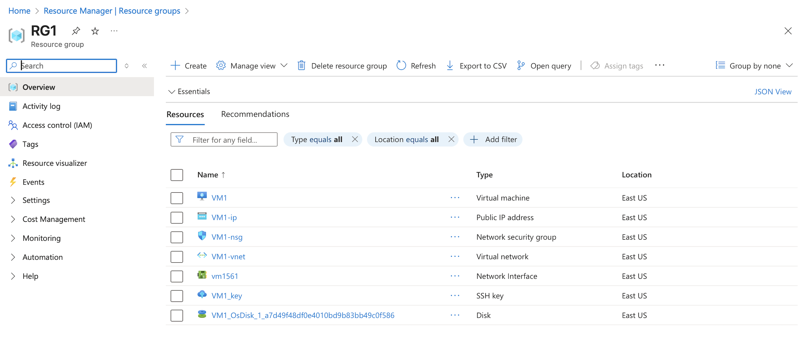
  - Deployed a free-tier Linux VM
  - Used SSH key authentication
    
  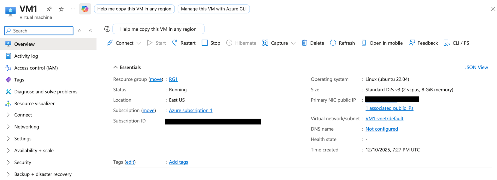

## 2. Create a Healthy Snapshot of the VM
- Created a snapshot
- Verified snapshot completion
  
  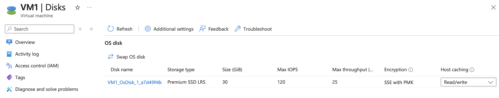
  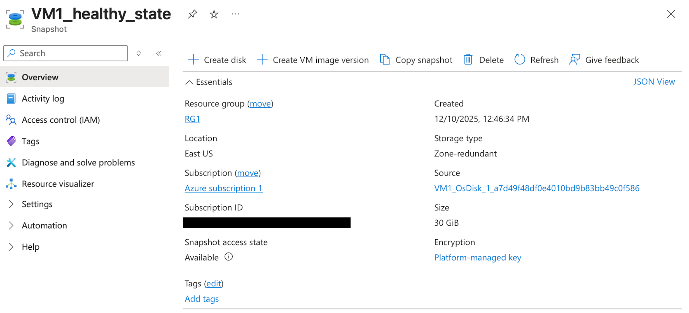

## 3. Simulate a Disaster
- SSH into the VM with ssh -i key_name.pem username@<VM_PUBLIC_IP>
- Created a file to signal a detrimental change
  
  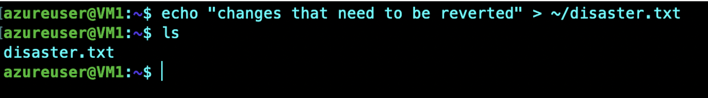

## 4. Restore the VM using the Snapshot
- Stopped the VM
  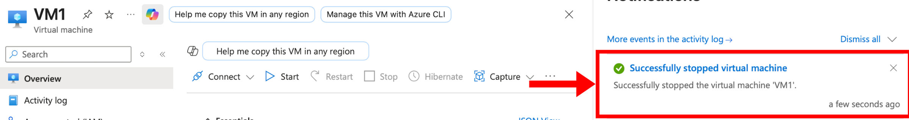
  
- Created a new disk from the healthy snapshot
  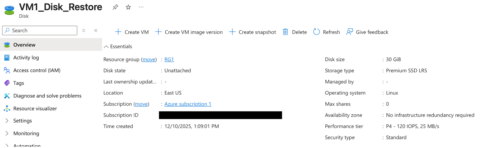
  
- Swapped the VM's OS disk with the new disk
  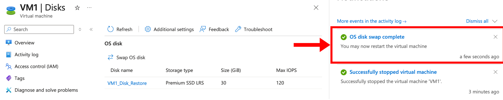
  
- Restarted the VM
  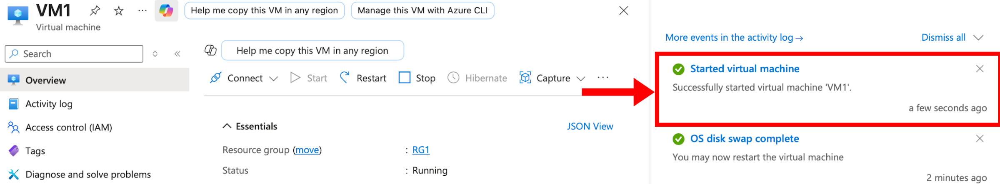
  
- SSH into the VM to confirm the restoration of the original state
  

## 5. Enable & View Metrics
- Opened VM -> Metrics
- Added charts for CPU Percentage & Disk IOPS
  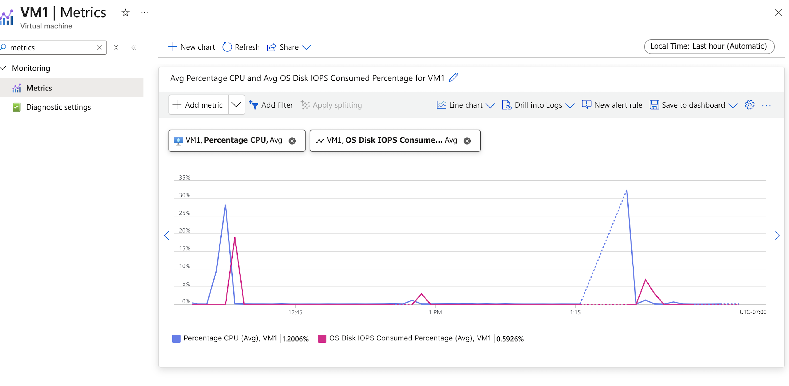

## 6. Create Storage Account & Blob Container
- Created a Standard LRS storage account
- Created a Blob container and uploaded a text file
  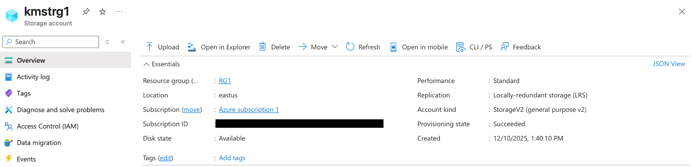
  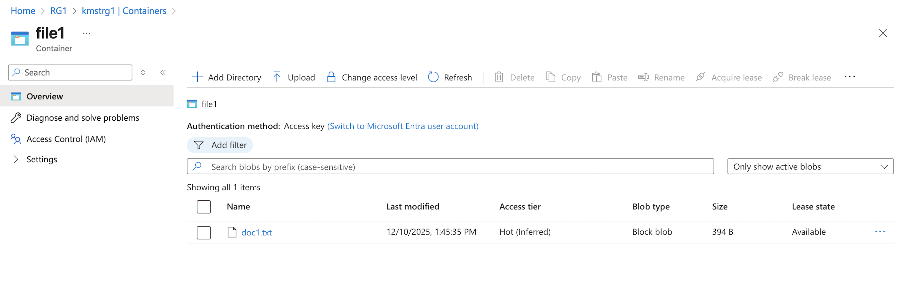

## Conclusion
This project demonstrates practical Azure administration capabilities:
- Provisioning compute resources
- Performing disaster recovery
- Enabling monitoring and troubleshooting
- Managing storage and backups
- Operating Azure resources cost-effectively

## Author
**Kaleb Maull**  
[LinkedIn](https://linkedin.com/in/kalebmaull)  
[GitHub](https://github.com/KMaullboy)

